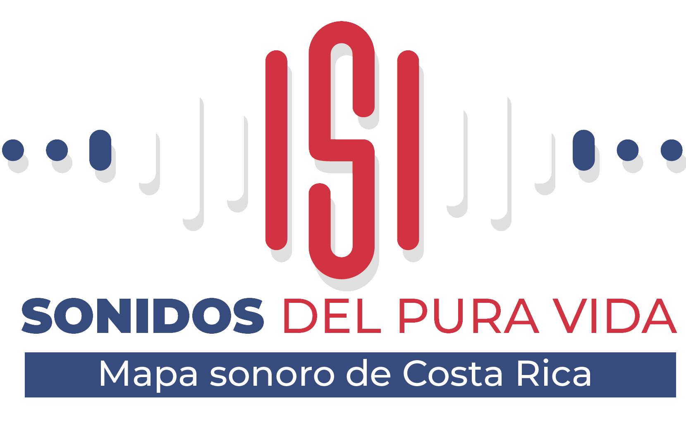

<!--
*** Thanks for checking out the Best-README-Template. If you have a suggestion
*** that would make this better, please fork the repo and create a pull request
*** or simply open an issue with the tag "enhancement".
*** Don't forget to give the project a star!
*** Thanks again! Now go create something AMAZING! :D
-->

<!-- PROJECT SHIELDS -->
<!--
*** I'm using markdown "reference style" links for readability.
*** Reference links are enclosed in brackets [ ] instead of parentheses ( ).
*** See the bottom of this document for the declaration of the reference variables
*** for contributors-url, forks-url, etc. This is an optional, concise syntax you may use.
*** https://www.markdownguide.org/basic-syntax/#reference-style-links
-->

<!-- PROJECT LOGO -->
 
<h1 align="center">
  
</h1>

  
  
  
  
  
  
  
  
  

     
    <a href="https://github.com/ALEXUSCR-27/Sonidos-PuraVida"><strong>Explore the docs »</strong></a>
     
     
    <a href="https://github.com/othneildrew/Best-README-Template">View Demo</a>
    
  

## About The Project

[![Product Name Screen Shot][product-screenshot]](https://github.com/ALEXUSCR-27/Sonidos-PuraVida)

“The sounds of Pura Vida” consists of a sound map of Costa Rica, with the aim of creating a memory of sounds of our country.
A sound map is an acoustic technique to know the sounds of a place, community or city by locating these sounds geographically.

<a href="#readme-top">Back to top ☝🏼</a>

